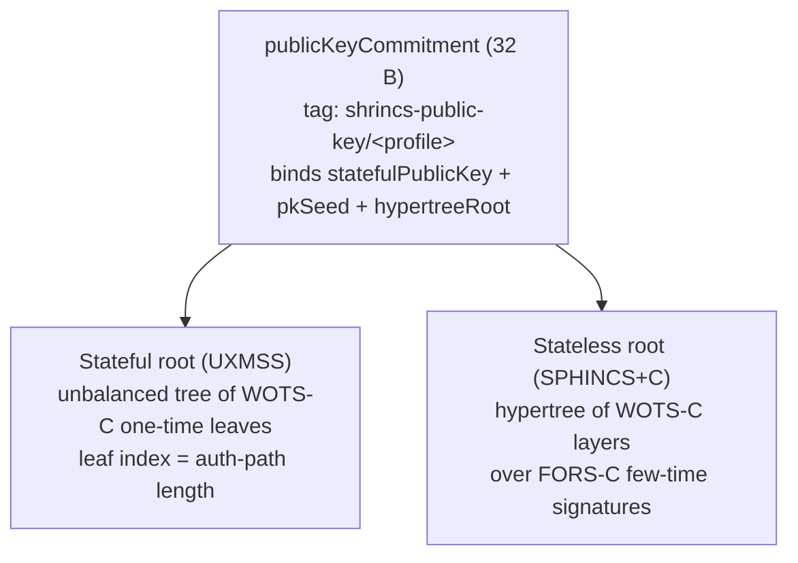

# hashsigs-rs

Core Rust hash-signature workspace with:

- `hashsigs-rs`: one crate containing:
  - `wotsplus` — the standalone WOTS+ one-time signature scheme (v1, legacy)
  - `sphincs_plus_c` — the stateless SPHINCS+C scheme
  - `shrincs` — the hybrid SHRINCS signer / verifier
  - `wasm` — verifier / signer bindings
- `solana/`: verify-only Solana program, plus an account-wrapper example at
  `solana/examples/shrincs-account/`
- `ts/`: `@quip.network/hashsigs-wasm`, the npm wrapper for the wasm build
- `py/`: the Python package scaffold (`hashsigs`). The binding API is under
  construction

This crate is the reference signer: it generates the golden vectors that
anchor the Solidity verifier in
[`hashsigs-solidity`](https://gitlab.com/quip.network/hashsigs-solidity).

## The SHRINCS construction

SHRINCS is a two-path hash-based signature construction
([ePrint 2025/2203](https://eprint.iacr.org/2025/2203), appendix). One
committed key bundle carries two verification paths with different costs and
budgets:

- **Stateful path (cheap, bounded).** A WOTS-C one-time signature under an
  unbalanced XMSS-style Merkle tree (UXMSS). Normal operations use this path.
  Each signature consumes one leaf, up to `maxSignatures` (at most 4,096).
- **Stateless path (expensive, break-glass).** A full SPHINCS+C signature: a
  FORS-C few-time signature carried up a hypertree of WOTS-C layers. Reserved
  for recovery and key rotation. Needs no signer state.



A 32-byte `publicKeyCommitment` binds both roots plus the profile identity.
Only the commitment needs on-chain storage. Callers resupply the full
164-byte public-key bundle on every verify, and the verifier recomputes and
checks the commitment. Verification is pure keccak-256 (SHA-256 for scheme
hashes in the sha2 profile) and grinds nothing. Signer state (nonces,
used-leaf tracking, budgets) belongs to the integrating account, not the
verifier.

### Components

Dependencies point only downward. Neither path knows about the other.
`shrincs` composes them at the API boundary.

- `shrincs` — the hybrid: commitment scheme, stateful + stateless dispatch,
  canonical action and rotation hashes.
- `shrincs::uxmss` — the stateful half: WOTS-C leaves under the unbalanced
  tree, crate-internal.
- `sphincs_plus_c` — the stateless half: FORS-C (`fors_c`) and the hypertree
  (`hypertree`). Oblivious to `shrincs`.
- `wots_c` — the shared WOTS-C target-sum chain walk, grind, and codec. Both
  paths bind it with their own domain tags. It calls into neither.
- `wotsplus` — standalone WOTS+ with checksum chains, the v1 wallet scheme.
  Not part of SHRINCS. **Legacy: do not use WOTS+ for new integrations. Use
  SHRINCS.** It stays only to keep v1 wallets verifiable.
- Scheme-neutral foundation at the crate root: `hash/` (tagged hash suite),
  `abi` (Solidity-compatible codec), `buf`, `profiles`, `treehash`.

### Research lineage

| Key | Paper | Role here |
|---|---|---|
| SHRINCS | Kudinov, Nick — *Hash-based Signature Schemes for Bitcoin*, [ePrint 2025/2203](https://eprint.iacr.org/2025/2203) | The hybrid construction. UXMSS is its App. B.3 |
| SPHINCS+C | Kudinov, Hülsing, Ronen, Yogev — *SPHINCS+C: Compressing SPHINCS+ With (Almost) No Cost*, [ePrint 2022/778](https://eprint.iacr.org/2022/778), IEEE S&P 2023 | The stateless path: WOTS-C target-sum chains, FORS-C grinding |
| SPHINCS+ | *SPHINCS+ Specification v3.1* (2022) | Base stateless design: `PK = (PK.seed, PK.root)`, FORS + hypertree |
| FIPS 205 | NIST — *Stateless Hash-Based Digital Signature Standard* (SLH-DSA) | Address-word conventions, with one documented deviation (below) |
| WOTS+ | Hülsing — *W-OTS+: Shorter Signatures for Hash-Based Signature Schemes*, AFRICACRYPT 2013 | Winternitz chains, shipped standalone as the legacy v1 scheme |
| RFC 8391 | *XMSS: eXtended Merkle Signature Scheme* | Baseline the stateful component departs from |

### Deltas against the standard constructions

Against SPHINCS+, the SPHINCS+C changes move work from the verifier to
signer-side grinding:

- **WOTS-C** drops the checksum chains. The signer grinds a counter until the
  message digits sum to a fixed target (480 at 256s, 240 at 128s). The
  verifier checks the target-sum equation.
- **FORS-C** grinds until the last FORS tree index is zero, so the signature
  reveals only `k − 1` trees.
- Each signature adds a 4-byte grind counter and a per-signature randomizer.

Against RFC 8391 XMSS, UXMSS differs in four ways:

- The tree is unbalanced and sized to any `maxSignatures`, with no
  power-of-two constraint.
- The leaf index is implicit: it equals the auth-path length.
- Leaves are WOTS-C, sharing chain machinery with the stateless side.
- Hashes use SPHINCS-style string tags (`uxmss-*`) instead of the RFC 8391
  ADRS structure.

Documented FIPS 205 deviation: the signer does not serialize upper-layer
hypertree coordinates. The verifier re-derives them. Layer-0 coordinates come
from the FORS digest, and each upper layer follows a fixed recurrence
(`src/sphincs_plus_c/hypertree.rs`).

## Parameters, sizes, and measured costs

Six compile-time profiles ship: three parameter sets, each in a keccak and a
sha2 variant. The cryptographic constants match the Solidity verifier.
`src/profiles/` is the Rust source of truth.

| Parameter | `256s` / `256s-sha2` | `128s-q18` / `128s-q20` and their sha2 twins |
|---|---|---|
| Scheme-hash suite | keccak-256 / SHA-256 | keccak-256 / SHA-256 |
| Hash entropy | 32 B | 16 B truncated (full 32-byte wire slots) |
| Hypertree | height 64, 8 layers | height 18, 1 layer |
| FORS-C | 22 trees, height 14 | 6 trees, height 24 |
| WOTS-C | 64 chains, w = 16, target sum 480 | 32 chains, w = 16, target sum 240 |
| Stateless signature budget | 2^20 | 2^18 (q18) / 2^20 (q20) |
| FORS-C grind bound | 2^24 | 2^28 |

`128s-q20` differs from `128s-q18` only in the stateless budget. The larger
q20 budget still needs security-analysis backing before production use. The
sha2 suite switches scheme hashes only, so `128s-q18-sha2` shares every row
of this table with `128s-q18`, and `128s-q20-sha2` with `128s-q20`. EVM-domain hashes (profile identity,
commitments, canonical action hashes) stay keccak under every profile, so the
128s and sha2 profiles change hashing work, not commitment framing.

Key material is constant across profiles:

| Item | Bytes | Layout |
|---|---|---|
| SHRINCS secret key | 264 | stateful(136) ‖ stateless(128): eight 32-byte seeds/roots + two 4-byte counters |
| SHRINCS public bundle | 164 | statefulPublicKey(68) ‖ commitment(32) ‖ pkSeed(32) ‖ hypertreeRoot(32) |
| publicKeyCommitment | 32 | the only on-chain key material |
| Stateful public key | 68 | pkSeed(32) ‖ root(32) ‖ maxSignatures(4 BE) |
| Stateless (SPHINCS+C) public key | 64 | pkSeed(32) ‖ root(32) |
| WOTS+ v1 key (legacy) | 32 secret / 64 public | seed / public_seed(32) ‖ pk_hash(32) |

### Per-variation sizes and costs

Signature sizes count packed field bytes. The stateful signature has no single
size: leaf `L` carries `L` auth nodes, so signatures grow 32 B per consumed
leaf. Sign time shrinks as `L` grows, because the auth-path rebuild covers
fewer remaining leaves. Native times: measured 2026-08-25 on one core of an AMD Ryzen 9
5950X, `--release`, `maxSignatures` = 1024, stateful sign at leaf 1. One
keygen derives both paths of a profile. Every row comes from the same sweep,
so the rows are comparable to each other.

This table lists all six published profiles.

| Variation | Path | Key size (secret / public) | Signature size | Keygen time | Sign time | Verify time | Solana verify cost (CU) |
|---|---|---|---|---|---|---|---|
| `shrincs-256s-keccak` | stateful | 264 B / 164 B | 2,084 + 32·L B (2,116 at L = 1) | 440 ms | 350 ms | 0.16 ms | 111,586 |
| `shrincs-256s-keccak` | stateless | 264 B / 164 B | 29,092 B | 440 ms | ~1.2 s | 1.5 ms | 1,029,780 |
| `shrincs-256s-sha2` | stateful | 264 B / 164 B | 2,084 + 32·L B (2,116 at L = 1) | 117 ms | 91 ms | 0.05 ms | 101,909 |
| `shrincs-256s-sha2` | stateless | 264 B / 164 B | 29,092 B | 117 ms | ~0.33 s | 0.43 ms | 931,804 |
| `shrincs-128s-q18-keccak` | stateful | 264 B / 164 B | 1,060 + 32·L B (1,092 at L = 1) | 45.2 s | 172 ms | 0.08 ms | 58,461 |
| `shrincs-128s-q18-keccak` | stateless | 264 B / 164 B | 5,704 B | 45.2 s | ~2.8 min | 0.17 ms | 106,555 † |
| `shrincs-128s-q20-keccak` | stateful | 264 B / 164 B | 1,060 + 32·L B (1,092 at L = 1) | 44.9 s | 173 ms | 0.08 ms | same as q18 (derived) |
| `shrincs-128s-q20-keccak` | stateless | 264 B / 164 B | 5,704 B | 44.9 s | ~2.8 min | 0.17 ms | same as q18 (derived) |
| `shrincs-128s-q18-sha2` | stateful | 264 B / 164 B | 1,060 + 32·L B (1,092 at L = 1) | 12.8 s | 46 ms | 0.02 ms | not measured ‡ |
| `shrincs-128s-q18-sha2` | stateless | 264 B / 164 B | 5,704 B | 12.8 s | ~47 s | 0.04 ms | not measured ‡ |
| `shrincs-128s-q20-sha2` | stateful | 264 B / 164 B | 1,060 + 32·L B (1,092 at L = 1) | 13.3 s | 47 ms | 0.02 ms | not measured ‡ |
| `shrincs-128s-q20-sha2` | stateless | 264 B / 164 B | 5,704 B | 13.3 s | ~51 s | 0.04 ms | not measured ‡ |
| `wotsplus` (v1, keccak, legacy) | one-time | 32 B / 64 B | 2,144 B | 0.41 ms | 0.20 ms | 0.23 ms | 298,064 |

† Measured through the `SphincsPlusCVerify` instruction. A SHRINCS stateless
signature is a SPHINCS+C signature plus a commitment check, and the hybrid
`ShrincsVerifyStateless` cost was not recorded at 128s.

‡ No SBF run has recorded these two profiles. The program builds against them
through `--features hashsigs-rs/profile-128s-q18-sha2`, so the figure is
missing, not unavailable. Do not read the keccak twin's cost across: the
SHA-256 syscall and the keccak syscall have different costs.

Notes:

- **Solana compute units** come from the SBF VM running the real program
  binary (`docs/solidity-parity.md`). `128s-q20` shares every crypto constant
  with `128s-q18`, so the table lists its cost as derived, not measured.
  The WOTS+ instruction pins keccak hashing, so its cost does not depend on
  the compiled profile.
- **WOTS+ v1 is legacy.** Do not use it for new integrations. Its row exists
  for reference: it stays in the crate only to keep v1 wallets verifiable.
  A 256s stateless signature (~30 KB) exceeds the 1,232-byte transaction MTU
  and also needs `ComputeBudgetInstruction::request_heap_frame`. Real
  deployments stage the payload in an account or use a 128s profile.
- **Stateless sign times** carry `~` because FORS-C signing grinds a counter
  (expected 2^14 tries at 256s, 2^24 at 128s). Each message is a fresh
  geometric draw, so times vary run to run. The table shows means over 3
  messages.
- **Sign and keygen scale with `maxSignatures`.** The signer recomputes the
  stateful auth path from seeds on every sign. Stateful sign time is the
  same order as keygen at the same budget.
- **128s trades signer time for on-chain cost.** The single-layer height-18
  hypertree makes keygen build 2^18 WOTS-C leaves (~45 s under keccak, ~13 s
  under sha2). Each stateless sign rebuilds it, grinds ~2^24 FORS-C tries,
  and builds six height-24 FORS trees (~2.8 min under keccak, ~50 s under
  sha2). In exchange, 128s has the smallest signatures and the cheapest
  verification. In-EVM 128s stateless signing is compute-infeasible, so the
  Rust signer generates those vectors.
- **ABI envelopes run larger than packed sizes.** The Rust `sign` envelope
  (public key + signature under `abi.encode` framing) is 2,784 B at 256s
  leaf 1 and 1,760 B at 128s leaf 1. A stateless signature blob alone is
  91,200 B at 256s and 18,016 B at 128s, about 3.2× its packed size,
  because `bytes`/`bytes[]` fields pay offset and length words.
- **The sha2 profiles are faster to sign and more expensive to verify
  on-chain.** They are faster on x86-64 CPUs with SHA extensions, where
  SHA-256 is hardware-accelerated and keccak is not: about 3.5× on this
  host. The EVM inverts that trade. `keccak256` is a native opcode, and
  SHA-256 is a precompile that charges more per word, so a sha2 profile
  costs more gas than its keccak twin. Pick sha2 when the signer is the
  bottleneck, and keccak when the verifier is.
- Regenerate the native numbers with the committed probes. Pass
  `--no-default-features` so one profile is selected and no other. The
  `profile-*` features are additive, and leaving the default on would keep
  measuring `256s`.

  ```bash
  BENCH_LABEL=256s-keccak   cargo run --release --example bench_table
  BENCH_LABEL=256s-sha2     cargo run --release --example bench_table --no-default-features --features profile-256s-sha2
  BENCH_LABEL=128s-q18      cargo run --release --example bench_table --no-default-features --features profile-128s-q18
  BENCH_LABEL=128s-q20      cargo run --release --example bench_table --no-default-features --features profile-128s-q20
  BENCH_LABEL=128s-q18-sha2 cargo run --release --example bench_table --no-default-features --features profile-128s-q18-sha2
  BENCH_LABEL=128s-q20-sha2 cargo run --release --example bench_table --no-default-features --features profile-128s-q20-sha2
  cargo run --release --example bench_wots
  ```

### EVM verify gas

Measured in `hashsigs-solidity` (account-wrapper call gas, 2026-07-13). The
stateful path is 8–14× cheaper than stateless. That asymmetry is the design
point: everyday operations ride the bounded stateful path, and the stateless
authority stays reserved for recovery.

| Call | 256s | 256s-sha2 | 128s-q18 / q20 | 128s-q18-sha2 / q20-sha2 |
|---|---|---|---|---|
| Stateful verify (wrapper call) | 190,792 | 281,063 | 117,759 | not measured § |
| Stateless verify (delegation) | 1,660,931 | 2,455,228 | 204,635 | not measured § |

§ The wrapper-call figures need the account-wrapper vectors, which do not
exist for the two 128s sha2 profiles yet. Instead this run measures the raw
stateless verifier directly, on the same call under each profile
(`SHRINCSSphincs128sVectors.testMeasureStateless128sVerifyGas`, 2026-08-25):
242,552 gas under `128s-q18` and `128s-q20`, and 317,515 gas under
`128s-q18-sha2` and `128s-q20-sha2`. That is the raw verifier, not the
wrapper call, so compare it only against the other number in this footnote.
The 1.31× ratio is the SHA-256 precompile against the `keccak256` opcode, and
it matches the direction of the preceding 256s pair.

The legacy standalone WOTS+ v1 verification is ~500k gas with its 2,144-byte
signatures.

## Building

To build the library:

```bash
cargo build
```

For release build:

```bash
cargo build --release
```

To build the Solana program:

```bash
cd solana
cargo build-sbf
```

## WASM packaging

The crate exposes a noble-style SPHINCS+C/SHRINCS signer surface under
`src/wasm/` behind the `wasm-bindings` feature. The supported build path is
`bin/build-wasm.sh`, which runs `cargo build` for `wasm32-unknown-unknown` and
then the `wasm-bindgen` command-line tool (not `wasm-pack`) for the `nodejs`
and `web` targets.

Prerequisites:

```bash
rustup target add wasm32-unknown-unknown
# Must equal the crate's wasm-bindgen dependency (Cargo.toml =0.2.100).
cargo install wasm-bindgen-cli --version 0.2.100
```

Build from the crate root (default output directory is `ts/src`):

```bash
./bin/build-wasm.sh
# or
./bin/build-wasm.sh ts/src
```

That writes:

```text
ts/src/nodejs/   # wasm-bindgen nodejs target (CommonJS)
ts/src/web/      # wasm-bindgen web target (ESM)
```

Optional custom output directory:

```bash
./bin/build-wasm.sh /tmp/hashsigs-wasm
```

The TypeScript package that wraps those bindings,
`@quip.network/hashsigs-wasm`, lives in `ts/`. After the wasm build:

```bash
cd ts
npm ci
npm run build   # also rebuilds wasm, inlines browser wasm as base64, runs tsc
npm test        # packaging conformance against dist/
```

Published consumers load one async entry point. The package `"browser"` field
swaps the Node loader for the browser loader at bundle time:

```ts
import { loadHashSigs } from "@quip.network/hashsigs-wasm";

const { shrincs } = await loadHashSigs();
const seed = crypto.getRandomValues(new Uint8Array(32));
const keys = shrincs.keygen(seed, 16);
```

CI builds and tests this package on merge requests and the default branch
(`ts-conformance` job). Version tags matching `vX.Y.Z` (optional pre-release
suffix) run the same build and publish to npm.

Current WASM scope:

- supported:
  - noble-style Uint8Array signer/verifier entry point (`loadHashSigs()`) for
    SPHINCS+C and SHRINCS keygen, sign, and verify
  - Node and browser packaging under `@quip.network/hashsigs-wasm`
- not implemented:
  - WOTS-specific wasm bindings
  - a separate `wasm-pack` / `pkg/<target>` layout

## SHRINCS profiles

Rust supports the same SHRINCS profile identities as the active Solidity
verifier:

- `shrincs-256s-keccak`
- `shrincs-256s-sha2`
- `shrincs-128s-q18-keccak`
- `shrincs-128s-q20-keccak`
- `shrincs-128s-q18-sha2`
- `shrincs-128s-q20-sha2`

Each profile selects a compile-time parameter tuple and profile identity.
The scheme-hash suite follows the profile:

- `256s-keccak`, `128s-q18-keccak`, `128s-q20-keccak`: internal scheme hashes use keccak
- `256s-sha2`, `128s-q18-sha2`, `128s-q20-sha2`: internal scheme hashes use SHA-256

Each sha2 profile is the exact numeric twin of the keccak profile of the same
name. The two differ only in the scheme hash suite and the identity string,
so a sha2 profile shares every key size, signature size, and tree shape with
its twin.

The six `profile-*` Cargo features are additive: enabling more than one
compiles more than one profile into the same build. Each profile is a type
that carries the `Profile` trait, named by its own module under
`hashsigs_rs::profiles`:

```rust
use hashsigs_rs::profiles::p256s::Shrincs as Shrincs256s;
use hashsigs_rs::profiles::p128s_q18::Shrincs as Shrincs128sQ18;
```

`hashsigs_rs::Shrincs` follows the profile the build binds to, so under
`--features profile-128s-q18` it is the q18 type, not the `256s` one. Name a
profile module's own alias, such as `hashsigs_rs::profiles::p256s::Shrincs`, to
pin one profile explicitly.

`build.rs` generates profile identity for every profile regardless of which
features are on, and emits a cfg for each enabled one. Rust-side surfaces
that still name exactly one profile (the non-generic `ShrincsVerifier`, the
wasm bindings, the golden-vector generator, and `hashsigs_rs::Shrincs`) bind
to a single profile chosen by a fixed priority order: `profile-256s`,
`profile-256s-sha2`, `profile-128s-q18`, `profile-128s-q20`,
`profile-128s-q18-sha2`, `profile-128s-q20-sha2`. Naming a profile
feature explicitly overrides the default (`profile-256s`), and enabling
several, or building with `--all-features`, resolves deterministically to
the first name in that order that is enabled.

Profile identity follows the Solidity `SHRINCSParams` model:

- `PROFILE_NAME` is the canonical suite-qualified profile string
- `PROFILE_ID` equals `keccak256(PROFILE_NAME)`
- Rust generates that identity at build time so the name and ID cannot drift

EVM-domain hashes remain keccak under every profile so Rust stays aligned with
the Solidity verifier on:

- profile identity framing
- hybrid public-key commitments
- canonical action-message hashes

The ignored vector generator writes one golden file per compiled profile:

- `tests/test_vectors/shrincs_sphincs_256s_keccak.json`
- `tests/test_vectors/shrincs_sphincs_256s_sha2.json`
- `tests/test_vectors/shrincs_sphincs_128s_q18_keccak.json`
- `tests/test_vectors/shrincs_sphincs_128s_q20_keccak.json`
- `tests/test_vectors/shrincs_sphincs_128s_q18_sha2.json`
- `tests/test_vectors/shrincs_sphincs_128s_q20_sha2.json`

The committed copies carry a `.gz` suffix. The generator writes the plain
`.json`, and the test loader reads either.

### Testing profiles

Run the default profile (`shrincs-256s-keccak`):

```bash
cargo test
```

Run a specific non-default profile:

```bash
cargo test --no-default-features --features profile-256s-sha2
cargo test --no-default-features --features profile-128s-q18
cargo test --no-default-features --features profile-128s-q20
cargo test --release --lib --no-default-features --features profile-128s-q18-sha2
cargo test --release --lib --no-default-features --features profile-128s-q20-sha2
```

The two 128s sha2 profiles run `--lib`, not the whole suite. Their
integration tests pin bytes against account-wrapper vectors, a separate
family generated in hashsigs-solidity, and that family does not exist for
these two profiles yet. Raise them to a full `cargo test` once
`tests/test_vectors/shrincs_account_wrapper_vectors_128s_q{18,20}_sha2.json.gz`
land.

For a fast compile-only check:

```bash
cargo test --no-run
cargo test --no-run --no-default-features --features profile-256s-sha2
cargo test --no-run --no-default-features --features profile-128s-q18
cargo test --no-run --no-default-features --features profile-128s-q20
cargo test --no-run --no-default-features --features profile-128s-q18-sha2
cargo test --no-run --no-default-features --features profile-128s-q20-sha2
```

The six profile features:

- default build selects `shrincs-256s-keccak`
- `profile-256s`
- `profile-256s-sha2`
- `profile-128s-q18`
- `profile-128s-q20`
- `profile-128s-q18-sha2`
- `profile-128s-q20-sha2`

Enabling more than one, or running `cargo test --all-features`, compiles
every enabled profile into the build and tests it. `cargo test --all-features`
also proves the profiles coexist correctly.

To regenerate the ignored SHRINCS golden vectors for the profile the build binds:

```bash
cargo test generate_shrincs_sphincs_vectors -- --ignored --nocapture
cargo test --no-default-features --features profile-256s-sha2 generate_shrincs_sphincs_vectors -- --ignored --nocapture
cargo test --no-default-features --features profile-128s-q18 generate_shrincs_sphincs_vectors -- --ignored --nocapture
cargo test --no-default-features --features profile-128s-q20 generate_shrincs_sphincs_vectors -- --ignored --nocapture
cargo test --no-default-features --features profile-128s-q18-sha2 generate_shrincs_sphincs_vectors -- --ignored --nocapture
cargo test --no-default-features --features profile-128s-q20-sha2 generate_shrincs_sphincs_vectors -- --ignored --nocapture
```

### Fast local loops

During development, prefer a narrow local loop over rerunning the full matrix
after every edit. `bin/test-fast.sh` wraps the common targeted commands:

```bash
./bin/test-fast.sh compile-default
./bin/test-fast.sh signer-stateful
./bin/test-fast.sh signer-exact generated_stateful_signature_verifies
./bin/test-fast.sh wasm-exact wasm_keypair_binding_signs_and_exports_public_key
./bin/test-fast.sh signer-import
./bin/test-fast.sh vectors-exact solidity_exported_stateful_action_vector_verifies_in_rust
./bin/test-fast.sh wasm-compile
./bin/test-fast.sh sha2-compile
```

Typical usage:

- use `compile-default` when you only need a fast native compile check
- use `signer-stateful`, `signer-import`, `signer-boundary`, `signer-stateless`,
  `signer-import-exact <test-name>`, or `signer-exact <test-name>` while
  editing SHRINCS signer code
- use `vectors-shrincs` when you only care about the SHRINCS Solidity-exported
  vector cross-checks, or `vectors-exact <test-name>` for one exact vector test
- use `wasm` for native wasm-module tests, `wasm-exact <test-name>` for one
  wasm case, and `wasm-compile` for wasm target compile coverage
- use `solidity-exact <test-name>` when you only want one
  `solidity_account_vectors` case
- use `wasm-compile` for wasm target compile coverage without trying to execute
  the `.wasm` artifact locally
- use `wasm-node` only when you want the actual Node-based wasm runtime tests
- run `cargo test` or `./bin/test-shrincs-profiles.sh` only after the narrow
  loop is clean

For an automatic polling loop on file changes:

```bash
./bin/test-watch.sh help
./bin/test-watch.sh signer-stateful
./bin/test-watch.sh signer-exact 1 generated_stateful_signature_verifies
./bin/test-watch.sh wasm-compile 2
```

`test-watch.sh` watches the crate's Rust, test, script, and build files and
reruns the selected `test-fast.sh` area whenever something changes.

## SHRINCS layout

`src/shrincs/` is flat: it has no `core`, `components`, `signers`, or
`verifiers` subdirectories. Its files:

- `mod.rs` — module root; owns commitment derivation and action-hash dispatch,
  and composes the independent `sphincs_plus_c` (stateless) and `uxmss`
  (stateful) modules.
- `key.rs` (`pub`) — the composed `Keys` type, the `Commitment` newtype
  (`Commitment::of`, `Commitment::from_bytes`), the `PublicKey` bundle wire
  type and its ABI codec, and `compute_commitment`/`recompute_commitment`/
  `recover_commitment`/`import`/`reset` plus 264-byte serialization.
  Consolidates the former `public_key.rs` to mirror `sphincs_plus_c::key`.
- `signer.rs` (`pub`) — `ShrincsSigner` (key generation, signing-key import,
  and stateless signing) and the free `sign` function (stateful signing that
  advances the key in place). Folds in the former `signer_types.rs` and
  `signer_utils.rs` helpers.
- `signature.rs` (`pub`) — the stateful signature wire type and the composite
  signature codecs.
- `verifier.rs` (`pub`) — `ShrincsVerifier`: `verify`, `verify_stateful`, and
  `verify_stateless`.
- `uxmss.rs` (`pub(crate)`) — the stateful half (UXMSS over WOTS-C):
  `SkSeed`/`PrfSeed`/`PkSeed`/`Root` newtypes, `PrivateKey`/`PublicKey`/`Key`,
  and stateful signing.
- `dispatch.rs` — internal action-hash dispatch glue.
- `vector_conformance.rs` — vector-conformance tests.
- `test_fixtures.rs` (`pub(crate)`) — test fixtures.

The stateless half, `sphincs_plus_c`, is a sibling top-level module at
`src/sphincs_plus_c/`, not a child of `shrincs/`. FORS-C and hypertree logic
live there (`fors_c.rs`, `hypertree.rs`). The scheme-neutral building blocks
(`hash/`, `abi.rs`, `buf.rs`, `profile.rs`, `profiles/`, `treehash.rs`) sit at the crate
root.

## WASM testing

Two layers cover the wasm surface:

1. **Rust host tests** (`cargo test --features wasm-bindings`): byte-length
   validation and feature-gated conversion logic on the host. They do not run
   the exported bindings inside a wasm runtime.
2. **TS packaging conformance** (`cd ts && npm test`, after `npm run build`):
   loads the built `dist/` package through both Node and browser loaders and
   exercises `loadHashSigs()` (keygen, sign, verify, stateful-leaf advance,
   import).

For Rust-only wasm target unit tests (optional), install a matching
`wasm-bindgen-test-runner` and run:

```bash
cargo test --features wasm-bindings --target wasm32-unknown-unknown
```

When changing `WasmShrincsKeys` or `WasmSphincsPlusCKeys` in `src/wasm/`,
treat the TS conformance suite as the packaging gate and the Rust suite as
the crypto gate.

## WASM API

`loadHashSigs()` is the noble-style entry point. It awaits the wasm module
once and resolves to `{ sphincsPlusC, shrincs, shrincsImportSigningKey }` —
two namespace objects plus one standalone function. Keys decompose into
nested objects (never a flat `secretKey`/`publicKey` field). Every leaf in
those objects and every sign/verify argument is a `Uint8Array`. The surface
carries no hex strings. After the initial `await`, every call is
synchronous.

`keygen` and `reset` require a caller-supplied 32-byte seed. The library has
no RNG: pass cryptographically secure random bytes, such as
`crypto.getRandomValues(new Uint8Array(32))` in the browser or Node's
`crypto.randomBytes(32)`/webcrypto. A weak seed produces a weak key, and
nothing in the library checks seed quality. See
[SECURITY.md](SECURITY.md#seed-entropy-is-the-callers-responsibility).

Messages are exactly 32 bytes. Callers pre-hash arbitrary data and pass the
32-byte digest, matching how the on-chain verifier treats its hash argument
as the signed message. A wrong-length message throws on sign and returns
`false` on verify. Verify never throws.

### SPHINCS+C (stateless, standalone)

```ts
import { loadHashSigs } from "@quip.network/hashsigs-wasm";

const { sphincsPlusC } = await loadHashSigs();

const seed = crypto.getRandomValues(new Uint8Array(32));
const keys = sphincsPlusC.keygen(seed);
// keys.secret: { skSeed: Uint8Array(32), prfSeed: Uint8Array(32) }
// keys.publicKey: { pkSeed: Uint8Array(32), root: Uint8Array(32) }

const sig = sphincsPlusC.sign(message32, keys);
const ok = sphincsPlusC.verify(sig, message32, keys.publicKey); // boolean
```

`sign` is stateless: it never mutates `keys`. `verify` never throws — a
malformed signature or wrong-length input is simply `false`.

### SHRINCS (hybrid, stateful with stateless recovery)

```ts
import { loadHashSigs } from "@quip.network/hashsigs-wasm";

const { shrincs } = await loadHashSigs();

const seed = crypto.getRandomValues(new Uint8Array(32));
const keys = shrincs.keygen(seed, maxSignatures); // maxSignatures defaults to 1024
// keys.stateless: SphincsPlusCKeys — never changes after keygen
// keys.stateful: { secret, publicKey, nextLeafIndex, remaining } — advances on sign()
// keys.publicKeyCommitment: Uint8Array(32)

const sig = shrincs.sign(message32, keys);               // STATEFUL: advances keys.stateful in place
const recovery = shrincs.signStateless(message32, keys); // stateless recovery path, no mutation

// shrincs.verify checks the commitment path: it hashes the public key the
// signature carries and compares against the pinned commitment.
const ok = shrincs.verify(sig, message32, keys.publicKeyCommitment);
// A stateless SHRINCS signature is a SPHINCS+C signature, so verifyStateless is
// a SPHINCS+C verify: pass keys.stateless.publicKey.
const okRecovery = shrincs.verifyStateless(recovery, message32, keys.stateless.publicKey);
```

`shrincs.signStateless` produces the same bytes as `sphincsPlusC.sign` under the
keypair's stateless key, and `shrincs.verifyStateless(sig, msg, keys.stateless.publicKey)`
is exactly `sphincsPlusC.verify(sig, msg, keys.stateless.publicKey)`.

`shrincs.sign` is stateful:

- each call consumes one one-time UXMSS leaf and advances `keys.stateful`
  (`nextLeafIndex`, `remaining`) **in place**: it mutates the same object the
  caller holds, so the next `sign` call automatically uses the next leaf. No
  new key object comes back.
- once the stateful budget runs out, it throws an `Error` with
  `error.code === "ERR_STATEFUL_LEAVES_EXHAUSTED"`. Call `shrincs.signStateless`
  for unlimited recovery-path signing past that point, or `shrincs.reset(keys,
  newSeed)` to start a fresh stateful chain. `reset` requires a new 32-byte
  seed (no library RNG, same rule as `keygen`), produces a new
  `publicKeyCommitment`, and leaves `keys.stateless` untouched.

Footgun: signing from a copy of `keys` taken before an earlier `sign` call
reuses a leaf, which breaks the one-time-signature security the scheme
depends on. The next section covers persisting `keys`. Do it after every
stateful `sign` call, and never sign again from an older snapshot.

Two more `shrincs` helpers work with commitments directly:
`computePublicKeyCommitment(keys)` recomputes the 32-byte commitment `keys`
currently implies, and `recoverPublicKeyCommitment(signature)` recovers the
commitment a given `shrincs.sign()` signature implies, like `ecrecover`.

### Persisting and importing a SHRINCS key

Serialize `keys` to its 264-byte flat secret with `shrincsKeysToSecretBytes`
and write that to disk or a database after every stateful `sign()` call. To
rebuild the keypair object on restart, use `shrincsImportSigningKey`:

```ts
import { loadHashSigs, shrincsKeysToSecretBytes } from "@quip.network/hashsigs-wasm";

const { shrincsImportSigningKey } = await loadHashSigs();

const persisted = shrincsKeysToSecretBytes(keys); // 264 bytes, after every sign()
const restored = shrincsImportSigningKey(persisted);
```

`shrincsImportSigningKey` recomputes both roots and the commitment from the
seeds and rejects a mismatch with `ERR_IMPORT_INVALID`. It accepts an
already-exhausted key: stateful signing then throws
`ERR_STATEFUL_LEAVES_EXHAUSTED`, but stateless signing still works.

See [SECURITY.md](SECURITY.md) for the operational rules around holding and
persisting this key material.

### Object shapes

Names match `ts/src/index.ts`, the source of truth for the decomposed key
types:

```ts
interface SphincsPlusCKeys {
  secret: { skSeed: Uint8Array; prfSeed: Uint8Array };
  publicKey: { pkSeed: Uint8Array; root: Uint8Array };
}

interface ShrincsKeys {
  stateless: SphincsPlusCKeys;
  stateful: {
    secret: { skSeed: Uint8Array; prfSeed: Uint8Array };
    publicKey: { pkSeed: Uint8Array; root: Uint8Array; maxSignatures: number };
    nextLeafIndex: number;
    remaining: number;
  };
  publicKeyCommitment: Uint8Array;
}
```

## Testing

Run all tests:

```bash
cargo test
```

Rust supports the three SHRINCS keccak profiles (`256s`, `128s-q18`,
`128s-q20`) and their three sha2 twins (`256s-sha2`, `128s-q18-sha2`,
`128s-q20-sha2`). The SHA-256 suite switch applies only
to SHRINCS scheme hashes (FORS-C, hypertree, WOTS-C, UXMSS). EVM-domain hashes
such as canonical action hashes and public-key commitments remain keccak to
match the Solidity design.

Run specific test vectors:

```bash
cargo test test_wotsplus_keccak256_vectors
```

Generate SHRINCS vectors for the Solidity verifier:

```bash
cargo test --test generate_shrincs_vectors -- --ignored --nocapture
```

Or run the generator for a specific profile:

```bash
cargo test --test generate_shrincs_vectors -- --ignored --nocapture
cargo test --features profile-256s-sha2 --test generate_shrincs_vectors -- --ignored --nocapture
cargo test --features profile-128s-q18 --test generate_shrincs_vectors -- --ignored --nocapture
cargo test --features profile-128s-q20 --test generate_shrincs_vectors -- --ignored --nocapture
```

The generator writes the profile-selected SHRINCS vector JSON inside this Rust
repository:

```text
tests/test_vectors/shrincs_sphincs_256s_keccak.json
tests/test_vectors/shrincs_sphincs_128s_q18_keccak.json
tests/test_vectors/shrincs_sphincs_128s_q20_keccak.json
tests/test_vectors/shrincs_sphincs_256s_sha2.json
```

SHRINCS public keys use one stateless `pkSeed` and one `hypertreeRoot`, matching
the SPHINCS+/FIPS-style `PK = (PK.seed, PK.root)` abstraction for the stateless
path, while the full hybrid bundle stays bound together by
`public_key_commitment`.

To use those vectors with the Solidity verifier tests, copy the generated file
for the active profile into the Solidity repository's matching fixture path:

```bash
# example: 256s-keccak
cp tests/test_vectors/shrincs_sphincs_256s_keccak.json \
  /path/to/hashsigs-solidity/test/test_vectors/shrincs_sphincs_256s_keccak.json

# example: 256s-sha2
cp tests/test_vectors/shrincs_sphincs_256s_sha2.json \
  /path/to/hashsigs-solidity/test/test_vectors/shrincs_sphincs_256s_sha2.json

# example: 128s-q18-keccak
cp tests/test_vectors/shrincs_sphincs_128s_q18_keccak.json \
  /path/to/hashsigs-solidity/test/test_vectors/shrincs_sphincs_128s_q18_keccak.json

# example: 128s-q20-keccak
cp tests/test_vectors/shrincs_sphincs_128s_q20_keccak.json \
  /path/to/hashsigs-solidity/test/test_vectors/shrincs_sphincs_128s_q20_keccak.json
```

For a quick local profile-matrix sweep, run:

```bash
./bin/test-shrincs-profiles.sh
```

To cross-check Solidity-exported account vectors against the Rust verifier,
first generate the account-vector JSON in `hashsigs-solidity`. Then copy it
into this Rust repository manually. The repos are separate, so this handoff
is manual by design.

```bash
# in hashsigs-solidity
bash dev/export-account-vectors.sh

# copy the generated JSON into hashsigs-rs manually
cp /path/to/hashsigs-solidity/test/test_vectors/shrincs_account_wrapper_vectors.json \
  tests/test_vectors/shrincs_account_wrapper_vectors.json
```

For the `shrincs-256s-sha2` profile:

```bash
# in hashsigs-solidity
FOUNDRY_PROFILE=256s-sha2-export \
  bash dev/export-account-vectors.sh \
  test/test_vectors/shrincs_account_wrapper_vectors_256s_sha2.json

# copy the generated JSON into hashsigs-rs manually
cp /path/to/hashsigs-solidity/test/test_vectors/shrincs_account_wrapper_vectors_256s_sha2.json \
  tests/test_vectors/shrincs_account_wrapper_vectors_256s_sha2.json
```

Committed Rust-side cross-check fixtures exist for every profile —
`shrincs-256s-keccak`, `shrincs-256s-sha2`, `shrincs-128s-q18`, and
`shrincs-128s-q20` — so `tests/solidity_account_vectors.rs` runs on all four.

Then run the Rust-side cross-check:

```bash
cargo test --test solidity_account_vectors
cargo test --no-default-features --features profile-256s-sha2 --test solidity_account_vectors
```

Generate the kth stateful gas vector for Solidity gas benchmarks. The
generator requires Foundry's `cast` on `PATH` and writes
`tests/test_vectors/shrincs_stateful_k_gas_vector.json` (gitignored):

```bash
cargo test --test generate_stateful_gas_vector -- --ignored --nocapture
```

Run Solana program tests:

```bash
cd solana
cargo test-sbf
```

For test output and backtrace:

```
RUST_BACKTRACE=1 cargo test-sbf -- --nocapture 2>&1
```

Show compute units only:

```
RUST_BACKTRACE=1 cargo test-sbf -- --nocapture 2>&1 | grep "compute units:"
```

## Development requirements

- Rust 1.95 or later, matching `rust-version` in Cargo.toml, the
  `rust-toolchain.toml` pin, and the CI `msrv` job
- Solana/Agave SBF cargo subcommands, including `cargo build-sbf` and
  `cargo test-sbf`, for Solana program development: https://solana.com/docs/intro/installation

On Mac, do not install Rust with brew. Use
https://www.rust-lang.org/tools/install instead.

## Project structure

```
.
├── bin/
│   └── build-wasm.sh  # cargo + wasm-bindgen helper (nodejs + web → ts/src)
├── src/
│   ├── hash/            # tagged hash suite (keccak / sha2)
│   ├── abi.rs           # Solidity-compatible ABI encode/decode
│   ├── profile.rs       # the Profile trait
│   ├── profiles/        # one module per compile-time parameter set
│   ├── treehash.rs      # Merkle tree hashing
│   ├── wots_c/, wotsplus/  # WOTS-C primitives / legacy v1 WOTS+
│   ├── sphincs_plus_c/  # stateless SPHINCS+C scheme (fors_c, hypertree, key)
│   ├── shrincs/         # composed SHRINCS keys, signer, verifier (flat)
│   │   ├── key.rs       # Keys / Commitment / PublicKey, public API
│   │   ├── signer.rs    # ShrincsSigner + free sign(), public API
│   │   ├── verifier.rs  # ShrincsVerifier, public API
│   │   └── uxmss.rs     # stateful UXMSS half, crate-internal
│   └── wasm/      # verifier / signer wasm-bindgen surface
├── examples/      # bench_table.rs / bench_wots.rs timing probes (README table)
├── ts/            # @quip.network/hashsigs-wasm (loadShrincsWasm entry)
├── py/            # Python package scaffold (hashsigs)
├── solana/        # Solana verify program
│   └── examples/shrincs-account/  # account-wrapper example program
└── tests/         # Test vectors and unit tests
```

## SHRINCS architecture

`shrincs` composes two independent schemes rather than layering shared
components:

- `sphincs_plus_c` (`src/sphincs_plus_c/`) — the stateless half, used for
  durable recovery.
- `uxmss` (`src/shrincs/uxmss.rs`, `pub(crate)`) — the stateful half, used for
  the fast-path signing chain.

`shrincs` binds the two into a `Keys` and exposes them through three public
modules: `key` (the composed key type, the `PublicKey` bundle, and the
`Commitment`), `signer` (`ShrincsSigner` and the free `sign`), and `verifier`
(`ShrincsVerifier`).

Public API stability note: the stable public surface is
`hashsigs_rs::shrincs::key`, `hashsigs_rs::shrincs::signer`, and
`hashsigs_rs::shrincs::verifier`.

## License

AGPL-3.0 (GNU Affero General Public License), see COPYING
